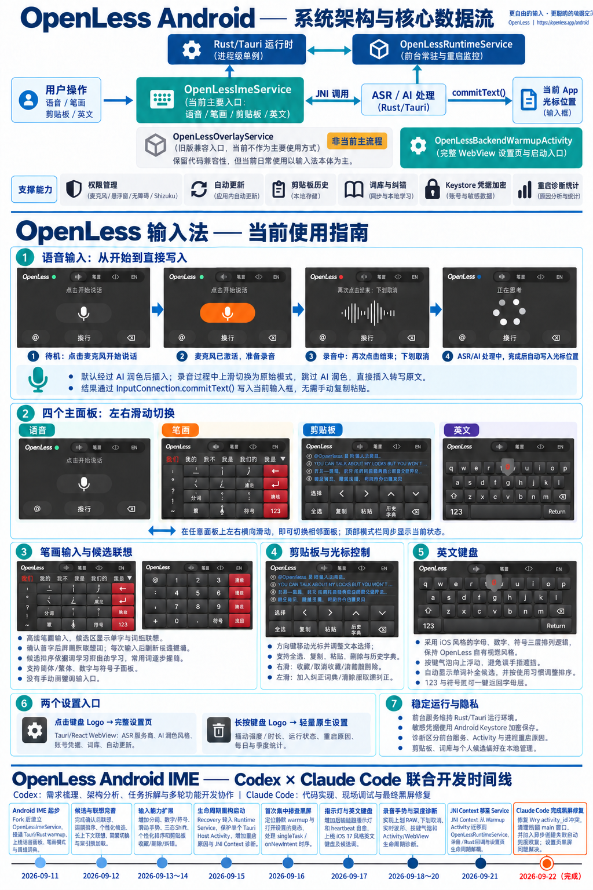
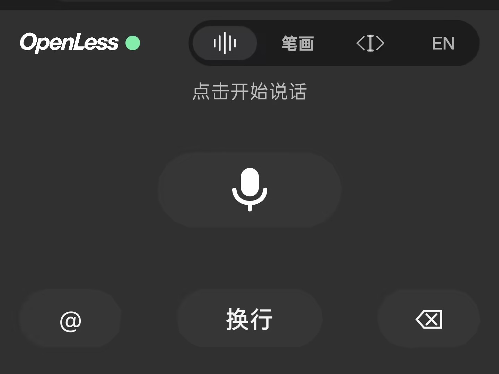
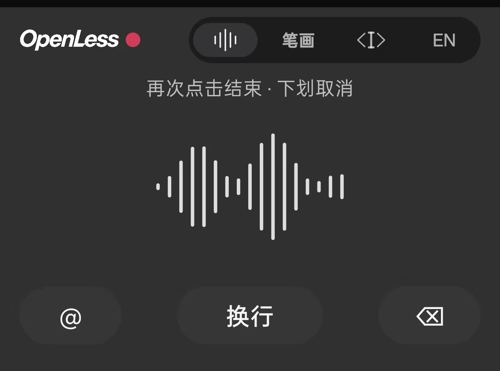
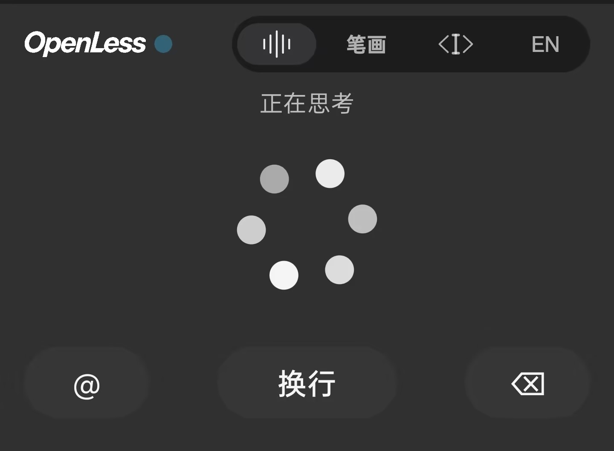
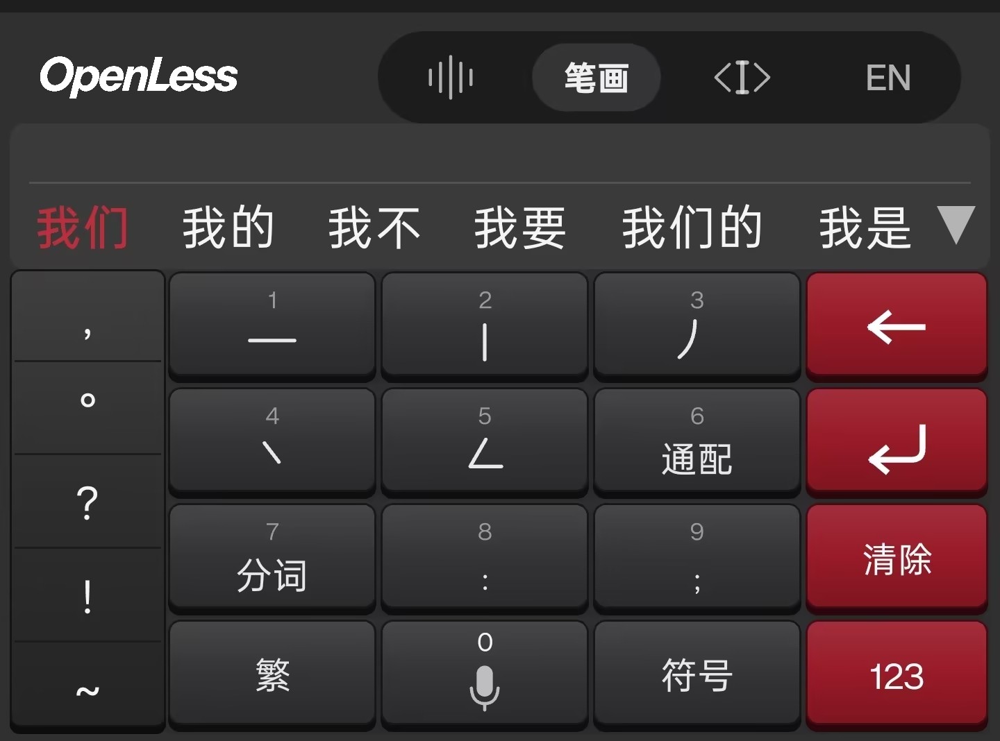
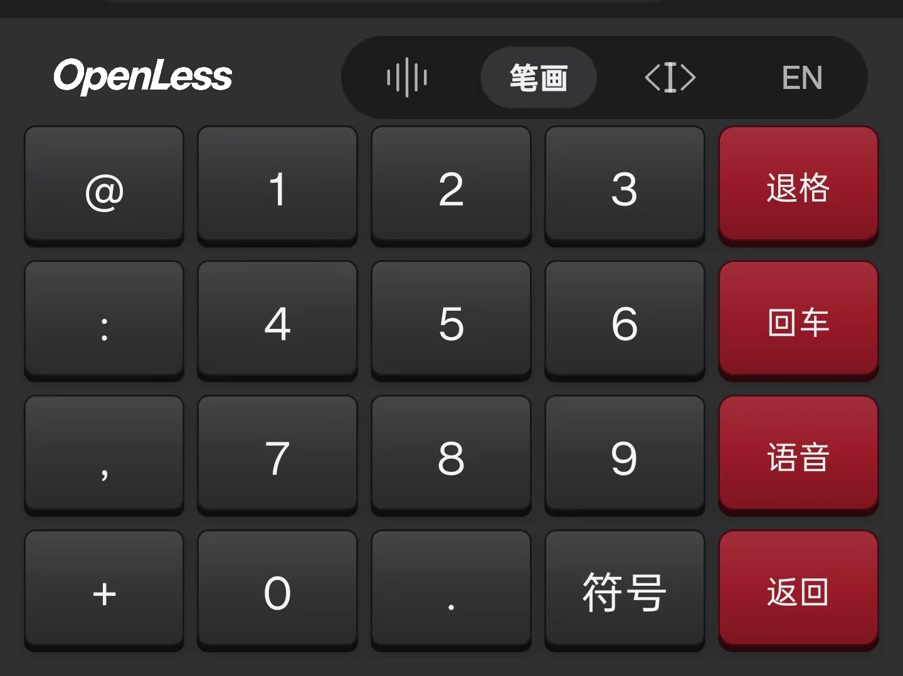
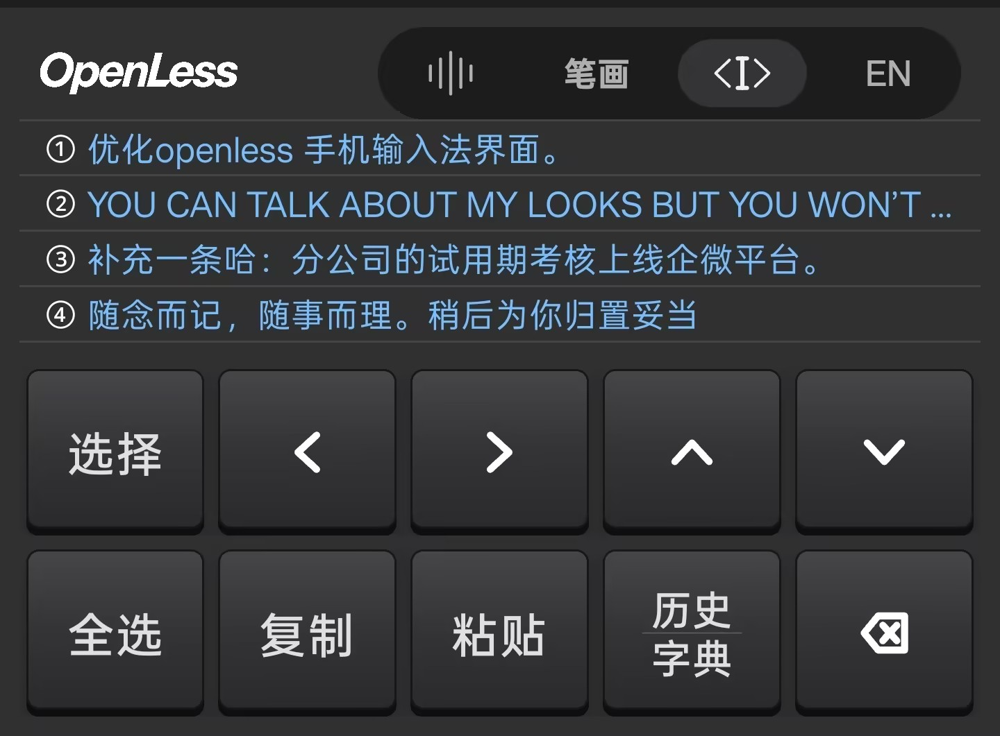
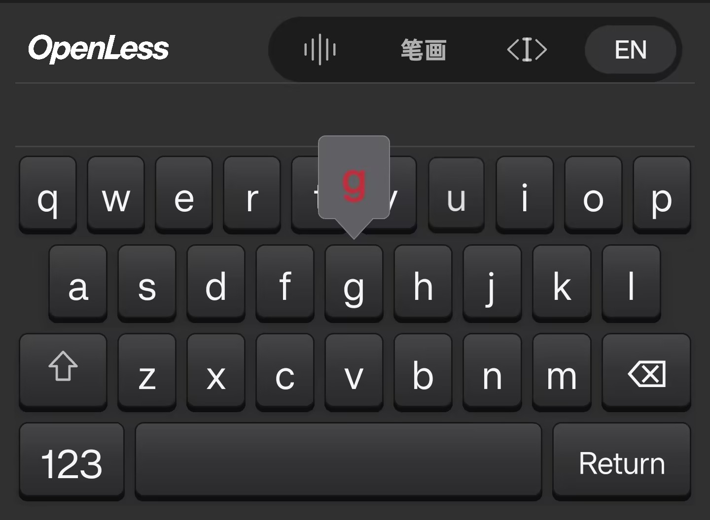

# OpenLess Android IME：架构、功能与 fork 演进

这份页面记录 Android 输入法分支从 `beta` fork 基线到当前实现的功能演进，并把界面截图与实际源码入口对应起来。它描述的是当前代码状态，不把构建成功等同于完整真机验收。

## 当前架构

用户操作进入 `OpenLessImeService`，它提供语音、笔画、剪贴板和英文四个输入面板，并通过 Android `InputConnection` 将结果提交到当前应用。Rust/Tauri 负责 ASR、AI 处理和共享后端；`OpenLessRuntimeService` 作为 `START_STICKY` 前台运行时监督器持有 JNI Activity Context；`OpenLessBackendWarmupActivity` 承载 Tauri/WebView 设置页与启动入口。

主要源码入口：

- `openless-all/app/android/kotlin/OpenLessImeService.kt`：四面板切换、语音生命周期、剪贴板/英文面板与跨面板 UI 基础设施。
- `openless-all/app/android/kotlin/StrokeInputController.kt`：笔画编码、候选/联想查询与提交、数字符号子面板；这是 2026-09-24 完成的第一处面板拆分。
- `openless-all/app/android/kotlin/OpenLessRuntimeService.kt`：运行时守护和 JNI Context 挂载。
- `openless-all/app/android/kotlin/OpenLessBackendWarmupActivity.kt`：Tauri host、设置页和 WebView 冷启动恢复。
- `openless-all/app/src-tauri/src/android/native_bridge.rs`：Rust ↔ Kotlin JNI 桥接。

## 已实现的 Android 输入能力

- 语音输入：录音、取消、原文/整理模式、波形/状态反馈，并通过 `commitText()` 写入当前光标位置。
- 笔画输入：离线笔画字典、单字候选、确认后的词语联想、分词、简繁偏好、数字/符号面板、上滑数字和个人词频。
- 剪贴板：历史记录、收藏/删除/分类、选择/复制/粘贴、纠正词写入全局词典。
- 英文键盘：字母/数字/符号三层布局、英文候选词、个人词频、自定义词长按删除、按键预览和上滑输入数字/符号。
- 跨应用插入：按可用性使用无障碍、Shizuku 或剪贴板回退；权限和输入法启用状态在 Android 侧单独管理。

## 2026-09-11 至 2026-09-24 的演进

`615d6ac4` 是 fork 后开发使用的 `beta` 基线，`0bc3a979` 是第一笔 Android IME 实现。之后的提交按功能阶段演进：

1. IME 服务骨架与四面板交互。
2. 笔画字典、索引、候选排序、联想、多编码、分词、简繁和个人词频。
3. 剪贴板历史、纠正词桥接、英文键盘、候选词和手势预览。
4. Runtime Service、Activity 生命周期、JNI Context、WebView 黑屏/冷启动恢复和重启诊断。
5. 2026-09-23 至 24：英文上滑数字/符号和长按删词；候选 View 复用；联想词典预热、缓存和 Trie 建索引优化；新增 `StrokeInputController`。

完整提交时间线可用以下命令复核：

```text
git log --reverse --format='%h %ad %s' --date=short 615d6ac4..HEAD
```

## 截图与使用说明



| 面板 | 截图 |
| --- | --- |
| 语音：待机、录音、思考 |    |
| 笔画：中文与数字/符号 |   |
| 剪贴板与英文 |   |

## 小米/Redmi 真机边界

现有开发记录确认 APK 已安装到包含小米设备在内的测试设备；但候选栏复用、控制器拆分和英文/笔画手势仍需要完整真机回归。正式发布前应继续覆盖：正常输入、分词联想、退格、数字/符号切换、简繁切换、跨键滑动、后台恢复、Activity 被系统回收后的冷启动，以及不同 OEM 的插入权限路径。

## 相关文档

- [Android 源码架构与开发记录](../openless-all/app/android/README.md)
- [根 README 的 Android 状态说明](../README.md#android-input-method)
- [Android 架构总览](architecture.md)
